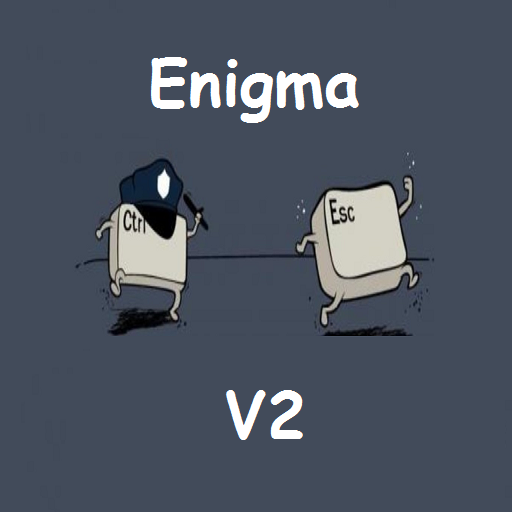

*** Enigma V2 Client ***

Enigma V2 Client für KODI Leia.

zum Testen von Enigma2 STB - MAG "Lines".

Zum Testen einfach

USERNAME 	(z.b.: username)
PASSWORD 	(z.b.: password)
URL 		(z.b.: http://deine.url.tv)
PORT 		(z.b.: 12345)

in den settings eintragen, 
oder die ""Update Funktion"" nutzen!

In der ""update.py"", in Line 17,
deine Daten eintragen 
und dann funktioniert auch das Update für Oma und Opa und Gott und die Welt
über einen Update Button im Addon!°
(Diese Funktion ist in der Public Obfuscate Version nicht verfügbar!!!)

Kodi nach der Installation, einmal bitte neustarten.

Only For Administration Or Development Environment!

Viel Spass!!!

* [Download](https://bit.ly/3RsMd3k)

